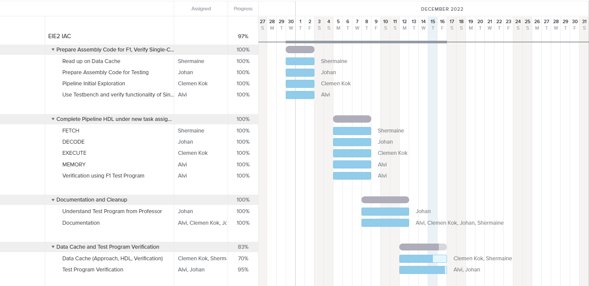

# **Team 8 IAC RISC-V CPU Coursework**
---

**Team Members:**
```
Johan Jino
Clemen Kok 
Shermaine Ang
Sohailul Islam Alvi
``` 
**Repository Tree**
```
Repository
    │   
    └───> main
    │      │----> README.md {Overview, Joint and Personal Statements}
    │      | 
    │      │----> rtl {Single-Cycle RISC-V}
    │      |       └───> README.md
    │      |       └───> risc_v.sv
    │      |       └───> risc_v_tb.cpp
    |      |
    │      └───> test {Single-Cycle RISC-V}
    │              └───> README.md
    │              └───> F1_program.asm
    │              └───> reference_program.asm
    │       
    │       
    │   
    └───> pipeline
    |      │----> rtl {Pipelined RISC-V}
    │      |       └───> README.md
    │      |       └───> risc_v.sv
    │      |       └───> risc_v_tb.cpp
    |      |
    │      └───> test {Pipelined RISC-V}
    │              └───> README.md
    │              └───> F1_program.asm
    │              └───> reference_program.asm
    |
    │       
    │   
    └───> cache
           │----> rtl {Pipelined RISC-V with Data Cache}
           |       └───> README.md
           |
           └───> test

```

## **Contribution Table**
---


**RISC-V Files**

|Module|Johan|Clemen|Shermaine|Alvi|
|---|---|---|---|---|
|control_unit.sv|*|
|pc_mux.sv|||*|
|data_mem.sv||*|
|risc_v.sv||||*|
|pc_Reg.sv|||*|
|datacache.sv||*|*||
|instr_mem.sv|*|
|sign_extend.sv|*|
|main/README.md|x|x|x|*|
|alusrc.sv||*|
|**/README.md||||*|
|reg_file.sv||*|
|risc_v_top.cpp||||*|
|control_unit.sv|*|
|alu.sv||*|
|F1_program.asm|x|x|x|x|
|sign_extend.sv|*|


---

**Pipeline Process**

|CPU Block|Johan|Clemen|Shermaine|Alvi|
|---|---|---|---|---|
|Fetch|||*|
|Data|*|
|Execute||*||
|Memory & Write||||*|
|Debug & Test|*|x|x|*|


```
 * = Principal Contributor
 x = Also Helped
```

## **Joint Statement of Contributions**
---

The RISC-V CPU was initially divided into four components based on the structure the team had used in Lab 4. Each member was assigned a specific area of contribution based on the various stages of the project, as outlined below.

|Member|GH Username|Tasks|Elaboration|
|---|---|---|---|
|Shermaine Ang|notmaineyy|Program Counter & Adders (Single-Cycle CPU) <br> FETCH Block (Pipelined CPU) <br> Data Cache <br> Documentations|1. Single-Cycle CPU (Lab 4): Prepared HDL for program counter and relevant adders. <br> 2. Single-Cycle CPU (Lab 4): Created testbench for program counter and adders, for testing of individual component. <br> 3. Assisted with deadline setting, to keep everyone in the team in the loop, and ensuring meetups are arranged. <br> 4. Pipeline Stage: Worked with Clemen on initial idea for Pipelining - Added DFF for PCPlus4D and PCD <br> 5. Johan suggested a change in our approach to reduce bugs. Worked on the HDL needed for the FETCH phase, and assisted with integration with the rest of the components. <br> 6. Added HDL needed for JALR in FETCH block. <br> 7. Read up on Data Cache <br> 8. Contributed to documentation.|
|Johan Jino|johanjino|GitHub Actions and CI/CD Pipeline <br> Control Unit (Single-Cycle CPU) <br> DATA Block (Pipelined CPU)|1. Created GitHub Actions to maintain automated tests and ensure stability of the repo by preventing errors to be merged <br> 2. Worked on overall assembly of the CPU and its verification <br> 3. Single-Cycle CPU: Prepared HDL for the control unit and integreted all units. <br> 4. Pipeline Stage: Defined HDL for the DATA block and integrated together all the blocks. <br> 5. Worked to the reference program execution and inference. <br> 6. Documentation for the above|
|Clemen Kok|clemenkok|Project Management <br> ALU (Single-Cycle CPU) <br> EXECUTE Phase (Pipelined CPU)|1. Created the Repo and coordinated meetings with the team.  <br> 2. Set up and maintained a Gantt Chart so that each team member would be clear on the team's objectives at the various phases of the project. <br> 3. Single-Cycle CPU: Prepared HDL needed for ALU and tested it with testbench. <br> 4. Came up with and worked with team to implement assembly code needed to test Single-Cycle CPU. <br> 5. Pipeline Stage: performed an initial exploration into how the team should approach Pipelining. Implemented HDL across all components on Single-Cycle CPU. <br> 6. Realised approach would lead to bugs that would be hard to find (mostly reusing old code). Prepared the HDL needed for the EXECUTE phase, and helped to integrate it with the rest of the components.  <br> 7. Came up with approach for Data Cache implementation and worked on HDL as well as data retrieval. <br> 8. Gave pointers on how others could improve their code; contributed to documentation.|
|Sohailul Islam Alvi|alvi-codes|Top-Level SV Module, <br> C++ Testbench, <br> Debug and Test, <br> Memory Block, <br> Execute Block, <br> Documentations| ...to be explained here... |

Verification of each stage was done during group meetings where each member could give feedback and do live troubleshooting. In addition, improvements to other members' contributions was communicated in the team chat. The Project Gantt Chart can be found below:  




## **Overview of the Objectives**
---


### **Objective 1:** 
**F1 Starting Light Algorithm in RV32I Assembly Language**

During our first meeting on the 1st of December from 0900 to 1100, we discussed about the implementation of the F1 Starting Light Algorithm in Assembly. We compared two methods of implementation: (1) adding 2^n to a0 (where n is the state number); and (2) using lw to load data into a0. We decided to go with (2) as it was a more straightforward implementation. 

Our algorithm is as follows (a first cut produced from the meeting, though we agreed that all should go and do their own implementation): 

```
main
0 lw a1 8(zero)
4 jal C # begin subroutine
8 beq a1 a1 3C # end the program

mloop
c lw a0 0(zero) # 8b'0 also li is psuedo instruction, we store it in data mem
10 lw a0 1(zero) # 8b'1
14 lw a0 2(zero) # 8b'11
18 lw a0 3(zero) # 8b'111
1C lw a0 4(zero) # 8b'1111
20 lw a0 5(zero) # 8b'11111
24 lw a0 6(zero) # 8b'111111
28 lw a0 7(zero) # 8b'1111111
2C lw a0 8(zero) # 8b'11111111
30 nop
34 nop
38 beq a0, a1, x0 # branch back to original pc+4 (saved in rd)

iloop
3C nop
40 beq a1 a1 3C
```

This method would enable the algorithm to start immediately upon trigger/reset. Trigger and Reset have the same functionality given that they both start the program. No interrupts are implemented.

We worked out a schedule for the project, given below.

|Date|Task|Members Involved|
|---|---|---|
|1/12/2022 - 5/12/2022|Prepare Assembly Code for F1, Verify Single-Cycle CPU (adding connections) and Prepare HDL for Pipelined CPU|Alvi, Clemen, Shermaine, Johan|
|5/12/2022 - 8/12/2022|Write Assembly Code to test Pipelined CPU and Verify|Johan and Alvi|  
|8/12/2022 - 12/12/2022|Data Cache|All|
|12/12/2022 - 16/12/2022|Project Buffer and Final Touches|All|

This schedule was mostly adhered to. Team Members decided to push back the Data Cache phase of the project to after 12/12/2022 to work on documentation and repo cleanup.

### **Objective 2:** 
**Single-Cycle RV32I Microarchitecture**


### **Objective 3:** 
**Pipelined RV32I Microarchitecture**
On the 5th of December 1600 to 1630, we discussed about how we should split up the tasks to get a pipelined CPU by the 8th of December for testing. We decided to split up the work as follows:


Distributed the work for this pipelined CPU as per the highlighted blocks above:

|Block|Member Responsible|
|---|---|
|Fetch|Shermaine Ang|
|Data|Johan Jino|
|Execute|Clemen Kok|
|Memory & Write|Sohailul Islam Alvi|

Each member made the necessary changes to the `risc_v.sv` top-level module file, to put togther their blocks into the design.

On the 8th of December 1000 to 1130, team members completed their individual phases of the Pipelining. We then added the components needed for Jump instructions and proceeded to test and debug the Pipelined CPU. A few bugs were detected: 
1. Write Enable in the Register File was not working as it should be. 
2. Missing lines of instructions. 

The Pipelined CPU worked as it should be after fixing the bugs. 

The working Pipelined CPU can be found in the `pipeline` branch. 

### **Objective 4:** 
**Pipelined RV32I Microarchitecture with Data Cache**
On the 13th of December, Clemen and Shermaine met and decided to implement the Data Cache based on the Direct Mapped Cache Hardware found in our lecture notes. The approach was to add the direct mapped cache hardware in parallel to the current Data Memory block. There will then be a multiplexer that chooses the data, based on the value of `Hit`, to send into the DFF block between the Memory -> Write process. 

More information on the approach, sketches and code can be found in the `cache` branch.
## **Personal Statements**
---

 **Johan Jino**

Single-Cycle CPU:
> write here....

Pipelined CPU:
> write here....
---

 **Clemen Kok**

Single-Cycle CPU:

>I worked on the ALU component of the CPU. To acomplish this, I prepared the HDL needed for the ALU and tested it with my own C++ testbench. I used Professor Cheung's notes on the ALU to verify that the HDL that I had prepared was functional. Then, I pushed it to the repository (commits are located in our Lab 4 Repository). Alvi and Johan assisted with integrating it and testing that it worked with the assembly program that we came up with.

Pipelined CPU:

>I looked ahead and figured out the team's approach for pipelining. This involved . After I realised that this would be quite buggy, I raised it up to the team. Johan came up with the idea of splitting the CPU into 4 components - FETCH, DECODE, EXECUTE, MEMORY - which we then proceeded to do. I prepared the  of the pipelined CPU. Johan and Alvi then focused on verifying its functionality with the test program as well as the program provided by Professor Cheung. Shermaine and I then focused on the implementation of Data Cache.

Data Cache:

>I proposed an approach for Data Cache during my discussion with Shermaine. Shermaine prepared the HDL needed for this approach, while I helped to . The team could have completed the verification for the Data Cache should we have had more time. 

---


 **Shermaine Ang**

Single-Cycle CPU:

>I was tasked to complete the Program Counter (PC) and the relevant adders. I created the HDL needed for the PC to work and also created a top level SysttemVerilog file to combine all the hardware components created for the PC. Before passing the work to Alvi for testing, I created a C++ testbench for the PC to verify if the PC was working as it should. It was working on its own, and then passed it on to Alvi to combine all the separate components together. <p> During the debugging phase, it was observed that the Single-Cycle CPU was not working as it should, and that there were some errors in the PC. The multiplexer that I had created had a clock, which was incorrect. My team members helped me fixed this error (as I was unwell). From this, I realised how important it was to work as a team, as there are times when I would miss out errors and other members would be able to help me find the errors that I have made, and work together to ensure that the entire thing works as it should be. <p> Moreover, Clemen had also told me an alternative to creating a whole block for a multiplexer. I could have used tenary statements in the top level file instead, which will simplify the creation and debugging processes. With this in mind, I later changed the code in the Pipelined CPU.

Pipelined CPU:

> Our team split the pipelining equally amongst ourselves, and I was in charge of the FETCH block, as it had components from the PC, which was what I had created earlier on. Remembering what I had learnt from Lab 4, instead of creating a whole block for a multiplexer, I used tenary statements instead in the top level file, which turned out to be a lot simpler. <p> During one of our meetings, we were implementing the Jump instructions, and I really enjoyed working as a team, as we all worked on different parts together, and I could ask my team members any questions I had. I was in charge of implementing a multiplexer within the FETCH block, and worked with Alvi and Johan as they were implementing hardwares in their respective blocks. Communicating with my team members in person made the implementation go really smoothly, as we could check with one another as soon as we had any issues. <p> When debugging the Pipelined CPU, our team supported one another to look out for errors, as mentioned previously, some might miss certain bugs, and these could be detected by others in the team. We eventually managed to debug our Pipelined CPU quite quickly with the help of everyone in the team. <p> Other than the HDL required, I also contributed to the documentation, ensuring that members are aware of what we have to do, and the respective deadlines. Clemen started doing this, and I felt that it was an important part, especially in a group setting, and hence, added on to the documentation whenever we had any discussions or set any deadlines for ourselves. 

Data Cache:

> Using Clemen's proposal of the approach for Data Cache, I reread the lecture notes to have a better understanding of how data cache worked. I prepared the  required for the approach, which was later further improved by Clemen, as I required some assistance. We, however, did not continue implementing the data cache as we encountered other problems, hence, testing has not been done for the data cache, but could have been completed if given more time. 
---

**Sohailul Islam Alvi**

Single-Cycle CPU:

 >So for the first objective of the course-work I have been resposnible to combine all my fellow group mates' works into a complete form, to produce the fully functional Single-Cycle RISC-V CPU design. I created the top level SystemVerilog file, and also created the C++ testbench to verify the correctness of our F1 program and the CPU architecture design. Then, with I have traced the outputs via a0 from our CPU, onto the GTKWave viewer, whose screenshots are included in the test forlder of the main branch. With it, I have also implemented the program outputs into the VBuddy and have recorded the behaviour of the F1 light sequence exactly a expected. <p> .... need to finish...  refernce test n implementation pipeline a ctivities n tests  plus tell about the readme file works done in all sections

Pipelined CPU:
> need to finish...  refernce test n implementation pipeline a ctivities n tests  plus tell about the readme file works done in all sections
---

