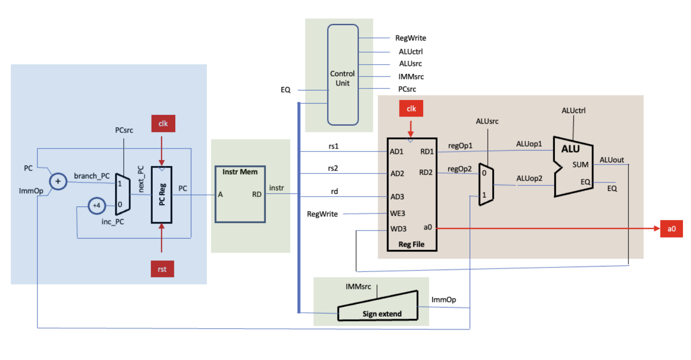

# Single-Cycle RISC-V Design
Upgraded and verified the Single-Cycle RISC-V design from Lab 4.

Initially distributed the work for this design based on the highlighted blocks above as in Lab 4:

|Block Colour|Member Responsible|
|---|---|
|Blue `pc`|Shermaine Ang|
|Green `control_unit`|Johan Jino|
|Red `alu`|Clemen Kok|
|Top-Level & Testbench `risc_v.sv` & `risc_v_tb.cpp`|Sohailul Islam Alvi|

Committed all our works into the `main` branch.

Shermaine, Johan and Clemen made the necessery changes to the `pc`, `control_unit` and `alu` folders respectively, making all the required upgrades to sucessfully run the F1 Assembly Code. 

Alvi combined the three blocks to form the functional Single-Cycle RISC-V in `risc_v.sv` and wrote the testbench `risc_v_tb.cpp` to test the design with the F1 Assembly Code.
