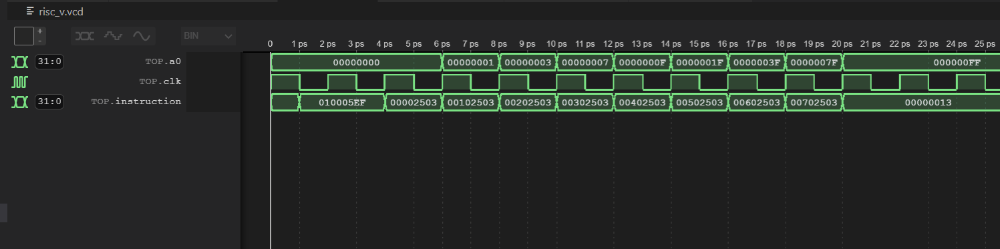
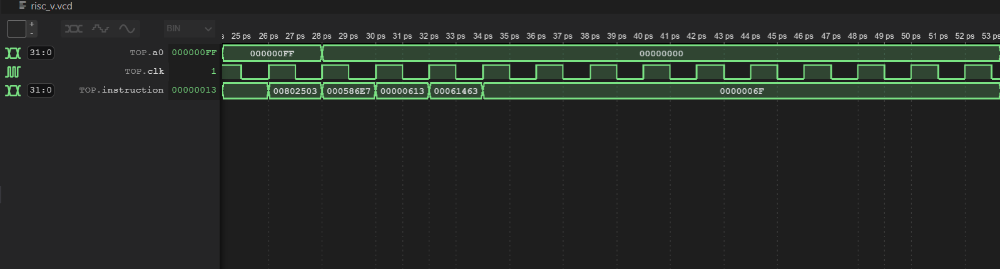
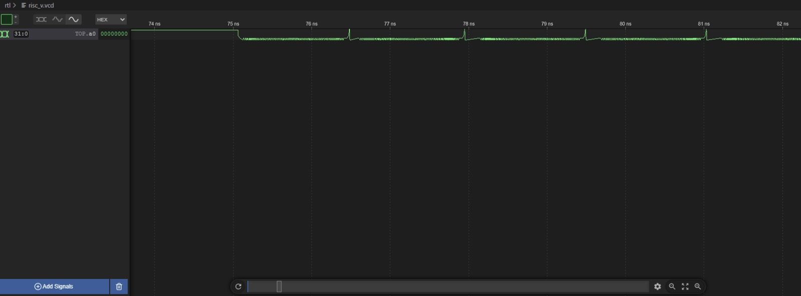
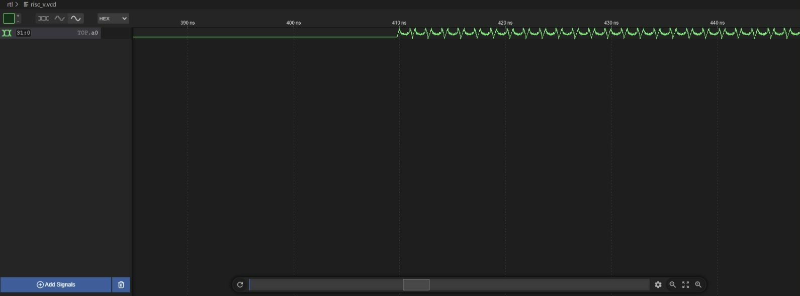
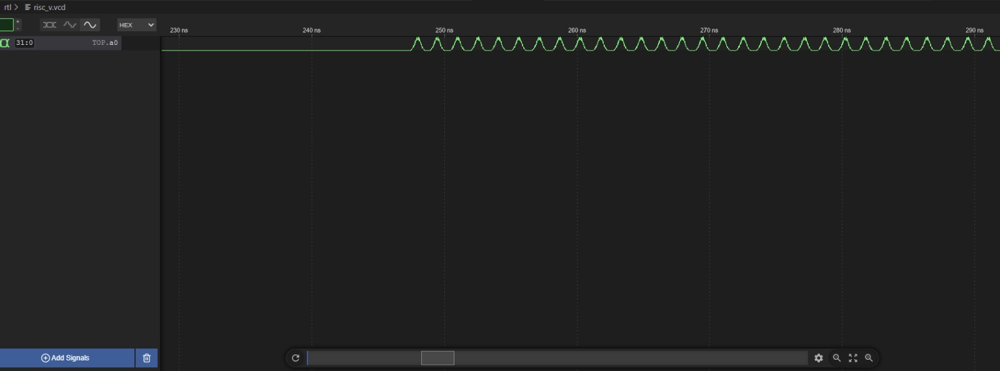

# Test Results & Proof of Success - Single Cycle 
This page displays the test programmes used to verify our design and the resultant outputs seen on the waveform viewer that prooves the correctness of our CPU design implemnetation working as per the needs of this course work.

In addition, we have also added videos that show the outputs for the F1 Program driving the neopixel bar on VBuddy and the trace values for the Reference Program plotted on the VBuddy's TFT display.

# F1 Program

The program developed and used by the team:
```
main:
	jal a1, iloop
    addi a2, zero, 0x0
    beq a2, zero, 0
    
iloop:
	lb a0, 0(zero)
    lb a0, 1(zero)
    lb a0, 2(zero)
    lb a0, 3(zero)
    lb a0, 4(zero)
    lb a0, 5(zero)
    lb a0, 6(zero)
    lb a0, 7(zero)
    nop
    nop
    nop
    lb a0, 8(zero)
    jalr a3, a1, 0
    
 mloop:
 	beq a2, zero, mloop
    
```
Resultant waveform view from the `risc_v.vcd` file:





Outputs from `a0` driving the neopixel bar on VBuddy:

https://user-images.githubusercontent.com/94545356/207889464-2af386c2-c6d5-4131-b1a0-d5279eadf1da.mp4

# Reference Program

To test, go to the `rtl` folder and run `source doit.sh`.

Resultant waveform view from the `risc_v.vcd` file:


### Sine ###

### Noisy ###


### Triangle ###


### Gaussian ###



### Explanation of waveforms ###
Having entered `_loop3`, `a0` will start taking the values at `mem[base_pdf+a1)`. The next line of instruction increments `a1` by 1, causing `a0` to take the value at the next address. This loop will keep repeating itself until the end of the pdf array. 


# Video Results on Vbuddy


### Gaussian ###
https://user-images.githubusercontent.com/92362159/208200591-e1e2f280-d535-47f6-a633-57afdd15538a.mp4

### Noisy ###

https://user-images.githubusercontent.com/92362159/208200690-38c2e128-2295-4b6e-abab-34ee7391b2a8.mp4

### Triangle ###

https://user-images.githubusercontent.com/92362159/208201031-877015b8-ac89-4b39-925e-a59cd555e7ef.mp4

### Sine ###

https://user-images.githubusercontent.com/92362159/208201069-a903c0e2-bd0a-4c7b-afd6-9ea72199a9f6.mp4


Sine and Triangle seemed off, which is unsure about. Since the Gaussian and Noisy was displayed perfectly, we believe the CPU is working correctly

